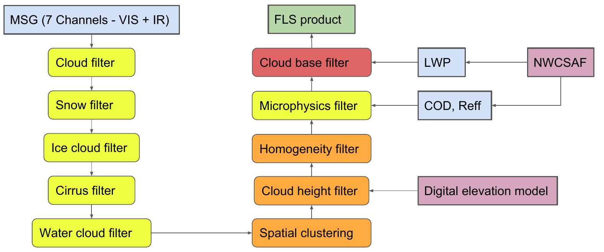

===================
Algorithms in fogpy
===================

The package provide different algorithms for fog and low stratus cloud
detection and nowcasting. The implemented fog algorithms are inherited 
from a base algorithm class, which defines basic common functionalities for
remote sensing procedures.

The fog and low stratus detection algorithm consists of a sequence of different
filter approaches that are successively applicated to the given satellite images. 
The sequence of filters and required inputs are shown in the scheme below:

The cloud microphysical products liquid water path (LWP), cloud optical depth (COD) 
and effective droplet radius (Reff) can be obtained from the software provided by the
Nowcasting Satellite Application Facility (NWCSAF) for example.

Fogpy algorithms
----------------

.. automodule:: fogpy.algorithms
   :members:
   :undoc-members: