============
 Fogpy usage in a nutshell
============

The package uses OOP extensively, to allow higher level metaobject handling.

For this tutorial, we will use a MSG scene for creating different 
fog products.

Import satellite data first
===========================

We start with the PyTroll package *satpy*. This package provide all functionalities 
to import and calibrate a MSG scene from HRIT files. Therefore you should make sure 
that mpop is properly configured and all environment variables like *PPP_CONFIG_DIR* 
are set and the HRIT files are in the given search path. For more guidance look up 
in the `satpy`_ documentation

.. _satpy: http://satpy.readthedocs.io/en/latest/install.html#getting-the-files-and-installing-them/

.. note::
	Make sure *satpy* is correctly configured!

Ok, let's get it on::

    >>> from satpy import Scene
    >>> from glob import glob
    >>> filenames = glob("/path/to/seviri/H-000*20131212000*")
    >>> msg_scene = Scene(reader="seviri_l1b_hrit", filenames=filenames)
    >>> msg_scene.load([10.8])
    >>> msg_scene.load(["fog"])

We imported a MSG scene from  12. December 2013 and loaded all twelve channels and the fog composite
into the scene object.

Now we want to look at the IR 10.8 channel::

	>>> msg_scene.show(10.8)

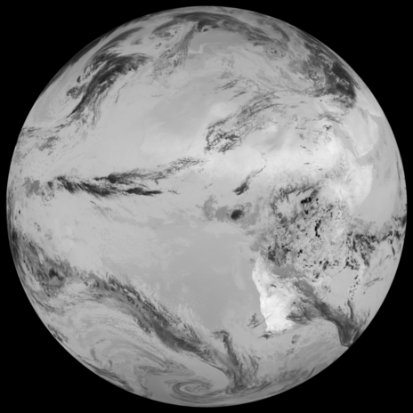

Everything seems correctly imported. We see a full disk image. So lets see if we can resample it to a central European region::

	>>> eu_scene = msg_scene.resample("eurol")
	>>> eu_scene.show(10.8)

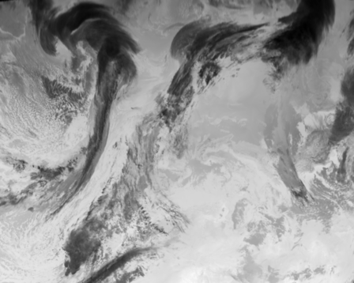

A lot of clouds are present over central Europe. Let's test a fog RGB composite to find some low clouds:: 

	>>> eu_scene.show("fog")

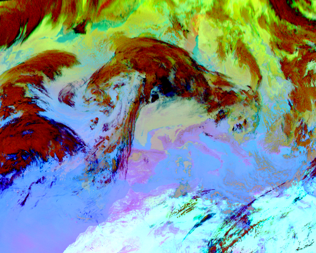

The reddish and dark colored clouds represent cold and high altitude clouds, 
whereas the yellow-greenish color over central and eastern Europe is an indication for low clouds and fog.

Continue with more metadata
===========================

In the next step we want to create a fog and low stratus (FLS) composite for the imported scene.
Therefore we have to provide some additional input data like elevation and cloud microphysical parameters.

Starting with the elevation information. Here we use a middle European section 
of the 1x1 km digital elevation model provided by the European Environmental Agency (`EEA`_).

.. _EEA: https://www.eea.europa.eu/data-and-maps/data/copernicus-land-monitoring-service-eu-dem
.. _satpy: https://github.com/pytroll/satpy

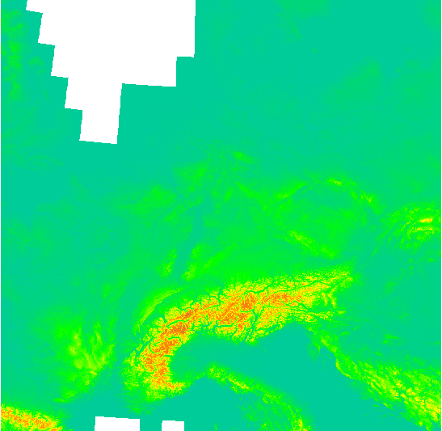

Let's import this DEM data and projection information with the geotiff import 
tool of the `satpy`_ package and create a area definition object for it::

    >>> tiff = Scene(reader="generic_image", filenames=["/Path/To/Geotiff/dem_eu_1km.tif"])
    >>> tiff.load(["image"])
    >>> tiffarea = tiff["image"].area

Now we have the elevation data as numpy array and the projection information as dictionary. 
The DEM projection differs from the MSG scene one::

	>>> tiffarea
	Area ID: laea_7238
	Description: laea_7238
	Projection ID: laea
	Projection: {'ellps': 'GRS80', 'lat_0': '52', 'lon_0': '10', 'proj': 'laea', 'towgs84': '0,0,0,0,0,0,0', 'units': 'm', 'x_0': '4321000', 'y_0': '3210000'}
	Number of columns: 1615
	Number of rows: 1578
	Area extent: (3483900.0, 2176000.0, 5098675.0, 3754425.0)
	>>> eu_scene["fog"].area
	Area ID: eurol
	Description: Euro 3.0km area - Europe
	Projection ID: ps60wgs84
	Projection: {'ellps': 'WGS84', 'lat_0': '90', 'lat_ts': '60', 'lon_0': '0', 'proj': 'stere'}
	Number of columns: 2560
	Number of rows: 2048
	Area extent: (-3780000.0, -7644000.0, 3900000.0, -1500000.0)
	
Lambert Azimuthal vs. Polar stereographic for the resampled European region and the geos - geostationary projection of the full disc MSG dataset.
So we have to reproject a dataset.
Here we resample the satellite data to the elevation information by using `pyresample`_::

	>>> from pyresample import image
	>>> from pyresample import utils
	>>> dem_scene = msg_scene.resample(tiffarea)

The satellite data for the middle European section looks like this (here the fog RGB composite has been displayed)::

	>>> dem_scene.show("fog")

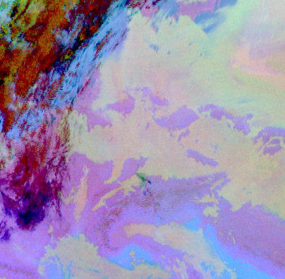

We continue with cloud microphysical products for the selected satellite scene from a NetCDF 
file provided by the Climate Monitoring Satellite Application Facility (`CMSAF`_). 

.. _CMSAF: www.cmsaf.eu
.. _pyresample: https://github.com/pytroll/pyresample
.. _trollimage: http://trollimage.readthedocs.io/en/latest/

Therefore we extract the parameters and meta information from the NetCDF file that are required for geolocation and resampling::
 

    >>> from datetime import datetime
    >>> time = datetime(2013, 12, 12, 10, 0)
    >>> cpp_file = '/media/nas/x21308/fog_db/cmsafdata/result_{}_cpp.nc'.format(time.strftime("%Y%m%d%H%M"))
    >>> import h5py
    >>> cpp = h5py.File(cpp_file, 'r')
    >>> proj4 = cpp.attrs["CMSAF_proj4_params"].decode("ascii")
    >>> extent = cpp.attrs["CMSAF_area_extent"]
    >>> cot = list(cpp["cot"])[0] * 0.01
    >>> reff = list(cpp["reff"])[0] * 1.e-08
    >>> cwp = list(cpp["cwp"][:])[0] * 0.0002
    >>> area_id = 'CPP_cmsaf'
    >>> area_name = 'Gridded cloud physical properties from CMSAF'
    >>> proj_id = 'CPP_cmsaf'
    >>> x_size = cot.shape[0]
    >>> y_size = cot.shape[1]
    >>> from pyresample import get_area_def
    >>> cpp_area = get_area_def(area_id, area_name, proj_id, proj4,
            	                      x_size, y_size, extent)

Afterwards the cloud optical depth (cod), effective droplet radius (reff) and the liquid water path (lwp) 
are extracted and resampled to the DEM projection again with the `pyresample`_ package::

	>>> cot_fd = image.ImageContainerQuick(cot, cpp_area)
	>>> reff_fd = image.ImageContainerQuick(reff, cpp_area)
	>>> cwp_fd = image.ImageContainerQuick(cwp, cpp_area)
	>>> cot_dem = cot_fd.resample(tiffarea)
	>>> reff_dem = reff_fd.resample(tiffarea)
	>>> cwp_dem = cwp_fd.resample(tiffarea)
	
Let's see how the data look like. We use the PyTroll package `trollimage`_ to 
visualize the cloud optical thickness product with automatic palettized colors in the range of 0 to 100::

	>>> from trollimage.colormap import set3
	>>> from trollimage.image import Image
	>>> img = Image(cot_dem.image_data, mode="L")
	>>> set3.set_range(0., 100.)
	>>> img.palettize(set3)
	>>> img.show()

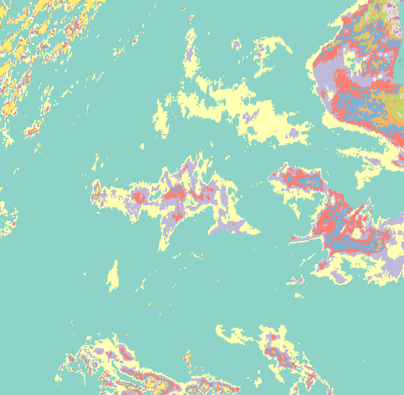

Get hands-on fogpy at daytime
=================================

After we imported all required metadata we can continue with a fogpy composite.

.. note::
	Make sure that the fogpy composites are made available in the mpop.cfg! 

Add the following to the mpop.cfg file in the [composites] field. The config file can be found in the *PPP_CONFIG_DIR*::

	[composites]
	>>> module=fogpy.composites

Now all fogpy composites can be used directly in mpop. Let's try it with the *fls_day* composite.
This composite determine low clouds and ground fog cells from a satellite scene. 
It is limited to daytime because it requires channels in the visible spectrum to be successfully applicable. 
We create a fogpy composite for the resampled MSG scene.
Use the elevation and micro-physical parameters that we imported above as additionally input for the composite::

	>>> fls_img, fogmask = dem_scene.image.fls_day(elevation.image_data,
	>>>                                    	       cot_dem.image_data,
	>>>                                            reff_dem.image_data,
	>>>                                            cwp_dem.image_data)

You see that we don't have to import the fogpy package manually.
It's done automagically in the background after the mpop configuration.

The *fls_day* composite function returns two objects:
 
- An image of a selected channel (Default is the 10.8 IR channel) where only the detected ground fog cells are displayed
- An image for the fog mask

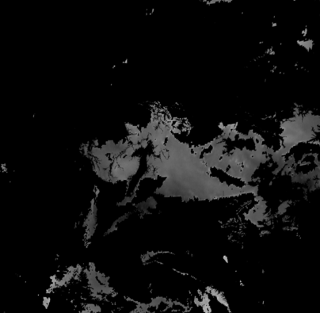
 
The result image shows the area with potential ground fog calculated by the algorithm, fine.
But the remaining areas are missing... maybe a different visualization could be helpful.
We can improve the image output by colorize the fog mask and blending it over an overview composite using trollimage::

	>>> from trollimage.image import Image
	>>> from trollimage.colormap import Colormap
	>>> fogcol = Colormap((0., (0.0, 0.0, 0.8)),
   	>>> 	              (1., (250 / 255.0, 200 / 255.0, 40 / 255.0)))
	    # Overlay fls image
	>>> fogmaskimg = Image(fogmask.channels[0], mode="L")
	>>> fogmaskimg.colorize(fogcol)
	>>> fogmaskimg.convert("RGBA")
	>>> alpha = np.zeros(fogmask.channels[0].shape)
	>>> alpha[fogmask.channels[0] == 1] = 0.5
	>>> fogmaskimg.putalpha(alpha)
	    # Background overview composite
	>>> dem_overview = dem_scene.image.overview()
	>>> dem_fogimg = Image(dem_overview.channels, mode='RGB')
	>>> dem_fogimg.convert("RGBA")
	    # Over blend fog mask
	>>> dem_fogimg.blend(fogmaskimg)
	>>> dem_fogimg.show()    	              
	>>> fls_img.show()

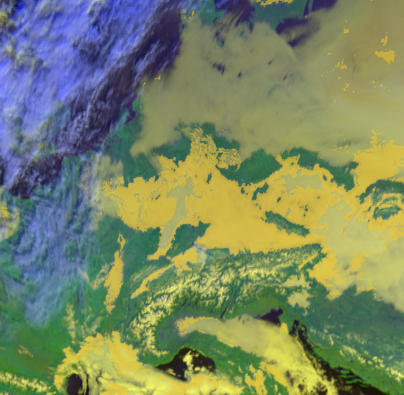

As additional default, all successively applied filter outputs are saved as images with yellow colored fitler mask result values in the */tmp* directory.

Here are some example algorithm results for the given MSG scene. 
As describt above, the different masks are blendes over the overview RGB composite in yellow, except the right image where the fog RGB is in the background:

+----------------------------------------+----------------------------------------+----------------------------------------+
| .. image:: ./fogpy_docu_example_13.png | .. image:: ./fogpy_docu_example_12.png | .. image:: ./fogpy_docu_example_14.png |
+----------------------------------------+----------------------------------------+----------------------------------------+
|              Cloud mask                |               Low cloud mask           |         Low cloud mask + Fog RGB       |
+----------------------------------------+----------------------------------------+----------------------------------------+

It looks like the cloud mask works correctly, except of some missclassified snow pixels in the Alps.
But this is not a problem due to the snow filter which successfully masked them out later in the algorithm. 
Interestingly low cloud areas that are found by the algorithm fit quite good to the fog RGB yellowish areas.

On a foggy night ... 
=================================

We saw how daytime fog detection can be realized with the fogpy *fls_day* composite.
But mostly fog occuring during nighttime. So let's continue with another composite
for nighttime fog detection **fls_night**:.

.. note::
	Again make sure that the fogpy composites are made available in the mpop.cfg!

First we need the nighttime MSG scene::

    >>> from datetime import datetime
    >>> from mpop.satellites import GeostationaryFactory
    >>> ntime = datetime(2013, 12, 12, 4, 0)
    >>> msg_nscene = GeostationaryFactory.create_scene(satname="meteosat",
    >>>                                               satnumber='10',
    >>>                                               instrument="seviri",
    >>>                                               time_slot=ntime)
    >>> msg_nscene.load()

Reproject it to the central European section from above and have a look at the infrared channel::
 
    >>> dem_nscene = msg_nscene.project(tiffarea)
    >>> dem_nscene.image[10.8].show()

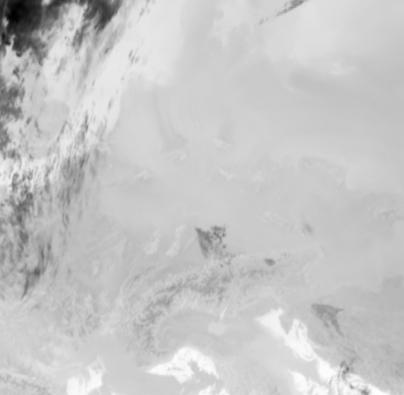

We took the same day (12. December 2017) as above. Now we could check whether the low
clouds, that are present at 10 am, already can be seen early in the the morning (4 am) before sun rise.

So let's look at the nighttime fog RGB product::

    >>> nfogimg = dem_nscene.image.night_fog()
    >>> nfogimg.show()

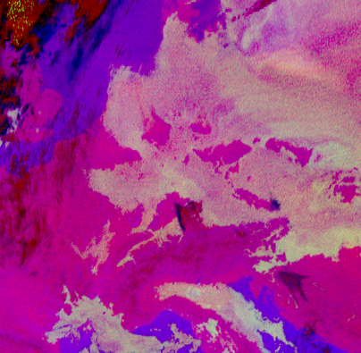

As we see, a lot of greenish-yellow colored pixels are present in the night scene. 
This is a clear indication for low clouds and fog. In addition these areas have a similar form and
distribution as the low clouds in the daytime scene.
We can conclude that these low clouds should have formed during the night.
 
So let's create the fogpy nighttime composite.
Therefore we only need the sun zenith angle as additional input. We can compute the angles with the PyTroll package `pyorbital`_::

    >>> from pyorbital import astronomy
    >>> lon, lat = tiffarea.get_lonlats()
    >>> nsza = astronomy.sun_zenith_angle(ntime, lon, lat)

The nightime composite for the resampled MSG scene
is generated in the same way like the daytime composite with `mpop`_::

    >>> nfls_img, nfogmask = dem_scene.image.fls_night(nsza)
    >>> nfls_img.show()

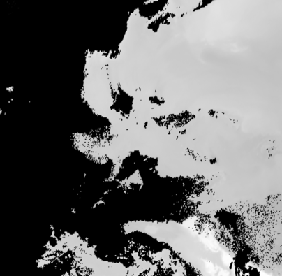

.. _pyorbital: https://github.com/pytroll/pyorbital

It seems, the detected low cloud cells in the composite overestimate the presence of low clouds,
if we compare the RGB product to it. In general, the nighttime algorithm exhibit higher uncertainty for the detection of low
clouds than the daytime approach. Therefore a comparison with weather station data could be useful.

Gimme some ground truth!
========================

Fogpy features some additional utilities for validation and comparison attempts.
This include methods to plot weather station data from Bufr files over the FLS image results.
The Bufr data is thereby processed by the `trollbufr`_ PyTroll package and the images are generated with `trollimage`_.
Here we load visibility data from German weather stations for the nighttime scene::
    
    >>> import os
    >>> from fogpy.utils import add_synop
        # Define search path for bufr file
    >>> bufr_dir = '/path/to/bufr/file/'
    >>> nbufr_file = "result_{}_synop.bufr".format(ntime.strftime("%Y%m%d%H%M"))
    >>> inbufrn = os.path.join(bufr_dir, nbufr_file)
        # Create station image
    >>> station_nimg = add_synop.add_to_image(nfls_img, tiffarea, ntime, inbufrn, ptsize=4)
    >>> station_nimg.show()

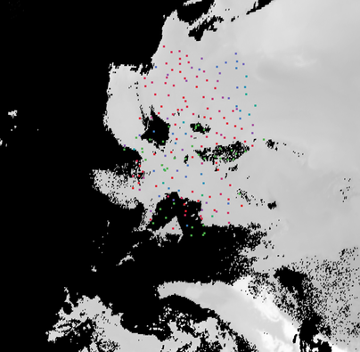
|
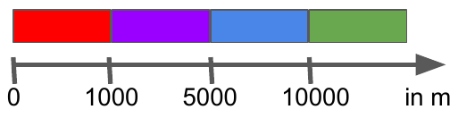

.. _trollbufr: https://github.com/alexmaul/trollbufr

The red dots represent fog reports with visibilities below 1000 meters (compare with legend),
whereas green dots show high visibility situations at ground level.
We see that low clouds, classified by the nighttime algorithm not always correspond to ground fog.
Here the station data is a useful addition to distinguish between ground fog and low stratus.

At daytime we can make the same comparison with station data::

    >>> bufr_file = "result_{}_synop.bufr".format(time.strftime("%Y%m%d%H%M"))
    >>> inbufr = os.path.join(bufr_dir, bufr_file)
        # Create station image
    >>> station_img = add_synop.add_to_image(fls_img, tiffarea, time, inbufr, ptsize=4)
    >>> station_img.show()

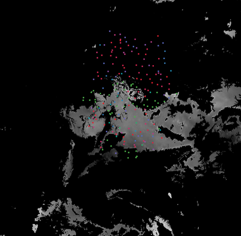

We see that the low cloud area in Northern Germany has not been classified as ground fog by the algorithm,
whereas the southern part fits quite good to the station data.
Furthermore some mountain stations within the area of the ground fog mask exhibit high visibilities.
This difference is induced by the averaged evelation from the DEM, the deviated lower cloud height and the 
real altitude of the station which could lie above the expected cloud top.
In addition the low cloud top height assignment can exhibit uncertainty in cases where a elevation 
based height assignment is not possible and a fixed temperature gradient approach is applied.  
These missclassifications could be improved by using ground station visibility data 
as algorithm input. The usage of station data as additional filter could refine the ground fog mask.

Luckily we can use the StationFusionFilter class from fogpy to combine the satellite mask with ground 
station visibility data. We use several dataset that had been calculated through out the tour as filter input
and plot the filter result::

    >>> from fogpy.filters import StationFusionFilter
        # Define filter input
    >>> flsoutmask = np.array(fogmask.channels[0], dtype=bool)
    >>> filterinput = {'ir108': dem_scene[10.8].data,
    >>>                'ir039': dem_scene[3.9].data,
    >>>                'lowcloudmask': flsoutask,
    >>>                'elev': elevation.image_data,
    >>>                'bufrfile': inbufr,
    >>>                'time': time,
    >>>                'area': tiffarea}
        # Create fusion filter
    >>> stationfilter = StationFusionFilter(dem_scene[10.8].data, **filterinput)
    >>> stationfilter.apply()
    >>> stationfilter.plot_filter()

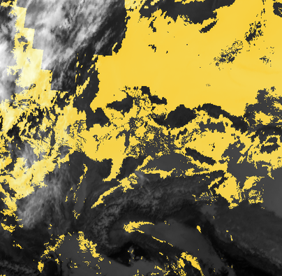

The data fusion revise the low cloud clusters in Northern Germany and East Europe as ground fog again.
The filter uses ground station data to correct false classification and add missing ground fog cases 
by utilising a DEM based interpolation. Furthermore cases under high clouds are also extrapolated by 
elevation information. This cloud lead to low cloud confidence levels. For example the fog mask over
France and England. The applicatin of this filter should be limited to a region for which station data
is available to achieve a high qualitiy data fusion product. In this case the area should be cropped to
Germany, which can be done by setting the *limit* attribute to *True*::

    >>> filterinput['limit'] = True
        # Create fusion filter with limited region
    >>> stationfilter = StationFusionFilter(dem_scene[10.8].data, **filterinput)
    >>> stationfilter.apply()
    >>> stationfilter.plot_filter()

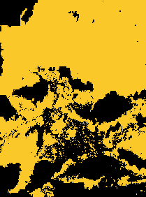

The output is now limited automagically to the area for which station data is available. 

The above station fusion filter example can be used to code any other filter application in fogpy.
The command sequence more or less looks like the same: 
 
 - Prepare filter input
 - Instantiate filter class object
 - Run the filter
 - Enjoy the results 

All available filters are listed in the chapter :ref:`filters`. Whereas the algorithms that can be directly
applied to PyTroll *Scene* objects can be found in the :ref:`algorithms` section. 
